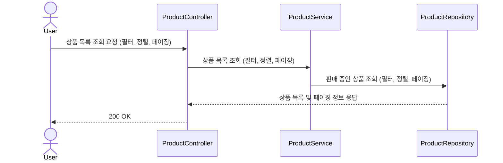
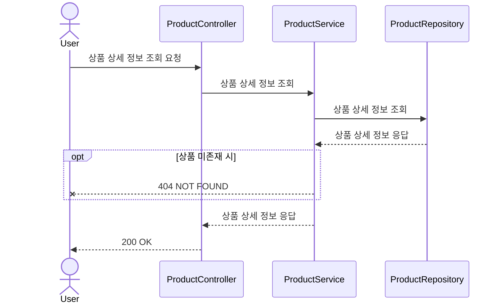
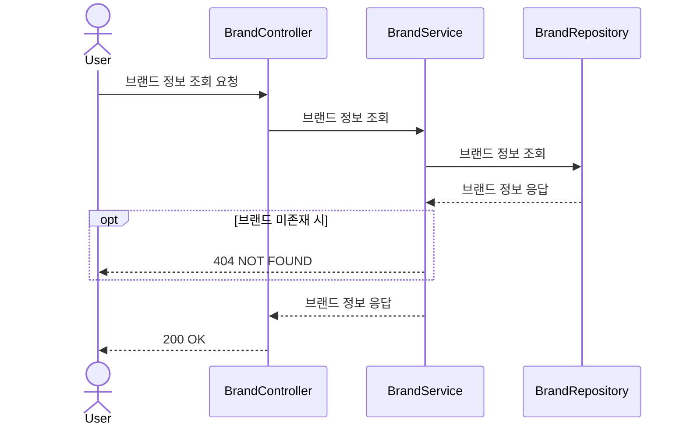
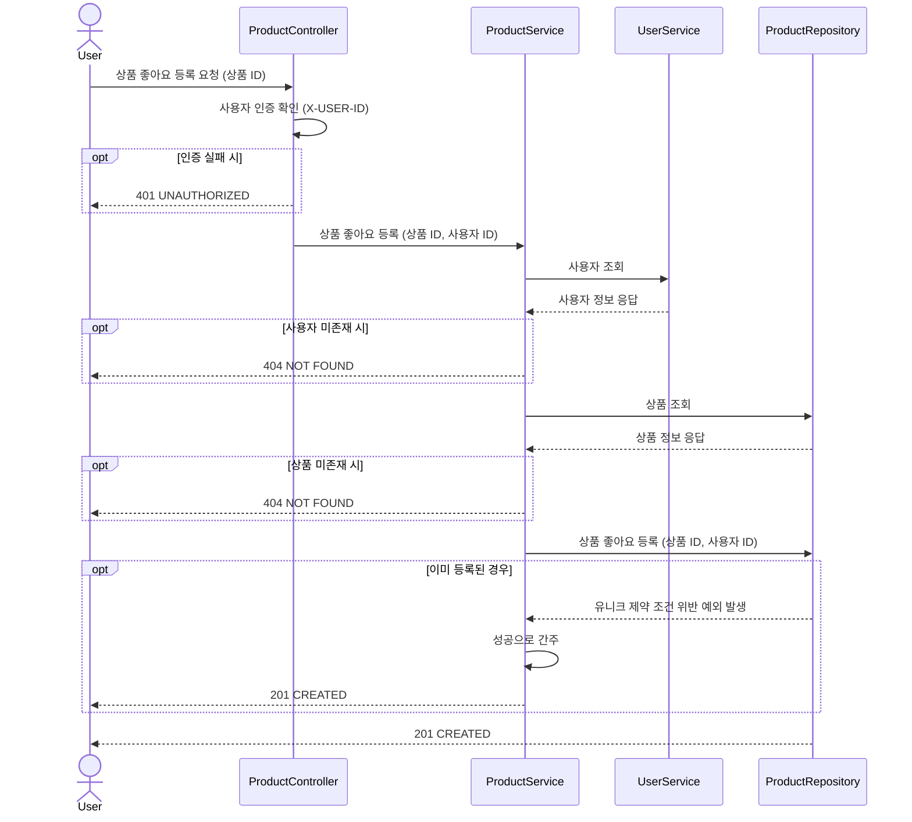
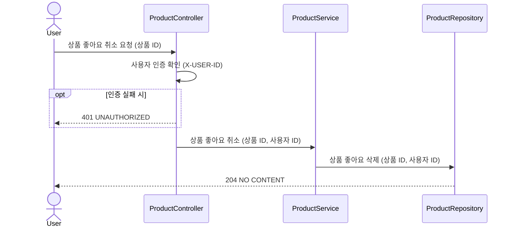
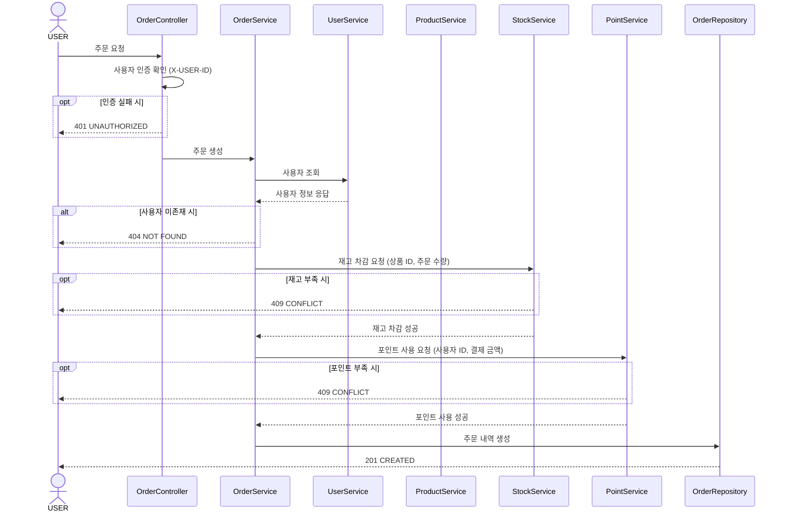
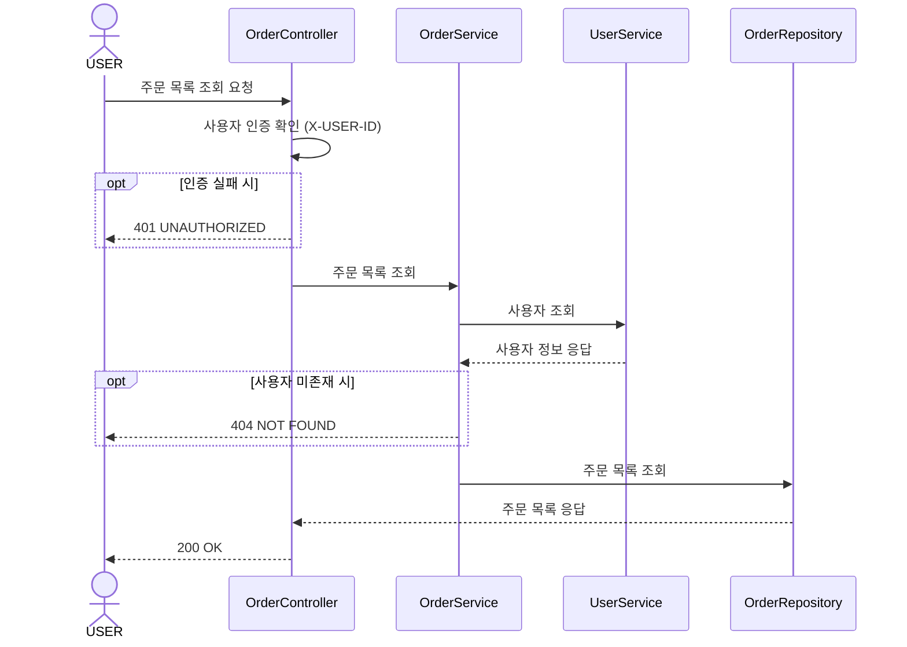
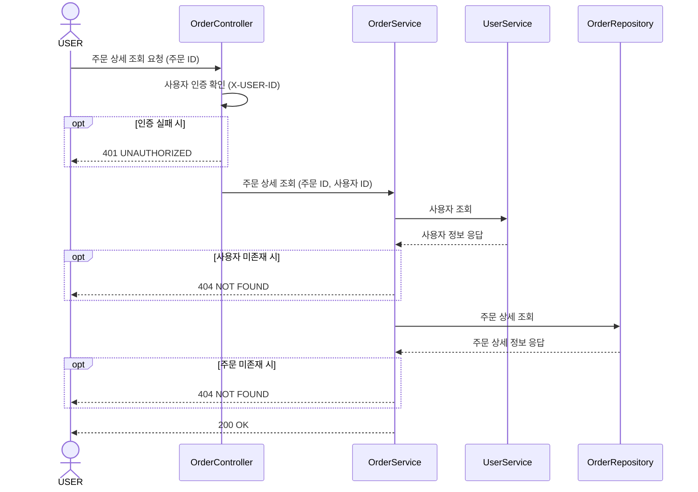

# 🏷 브랜드 & 상품 (Brands / Products)

## 📌 상품 목록 조회

## 📌 상품 상세 정보 조회

## 📌 브랜드 정보 조회

---

# ❤️ 좋아요 (Likes)

## 📌 상품 좋아요 등록

## 📌 상품 좋아요 취소

---

# 🧾 주문 / 결제 (Orders)

## 📌 주문 요청

## 📌 주문 목록 조회

## 📌 주문 상세 조회

