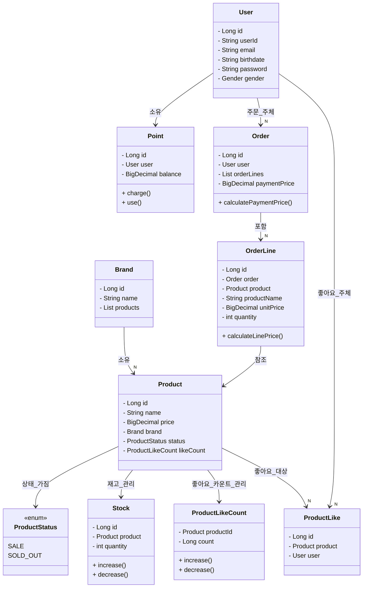

```mermaid
classDiagram	
	class Brand {
		- Long id
		- String name
		- List<Product> products
	}
	
	class Product {
		- Long id
		- String name
		- BigDecimal price
		- Brand brand
		- ProductStatus status
		- ProductLikeCount likeCount
	}
	
	class ProductStatus {
		<<enum>>
		SALE
		SOLD_OUT
	}
	
	class ProductLikeCount {
		- Product productId
		- Long count
		+ increase()
		+ decrease()
	}
	
	class ProductLike {
		- Long id
		- Product product
		- User user
	}
	
	class User {
		- Long id
		- String userId
		- String email
		- String birthdate
		- String password
		- Gender gender
	}
	
	class Order {
		- Long id
		- User user
		- List<OrderLine> orderLines
		- BigDecimal paymentPrice
		+ calculatePaymentPrice()
	}
	
	class OrderLine {
		- Long id
		- Order order
		- Product product
		- String productName
		- BigDecimal unitPrice
		- int quantity
		+ calculateLinePrice()
	}
	
	class Point {
		- Long id
		- User user
		- BigDecimal balance
		+ charge()
		+ use()
	}
	
	class Stock {
		- Long id
		- Product product
		- int quantity
		+ increase()
		+ decrease()
	}
	
	Brand --> "N" Product : 소유
	Product --> "N" ProductLike : 좋아요_대상
	Product --> ProductLikeCount : 좋아요_카운트_관리
	User --> "N" ProductLike : 좋아요_주체	
	User --> "N" Order : 주문_주체
	Order --> "N" OrderLine : 포함
	OrderLine --> Product : 참조
	User --> Point : 소유
	Product --> Stock : 재고_관리
	Product --> ProductStatus : 상태_가짐
```