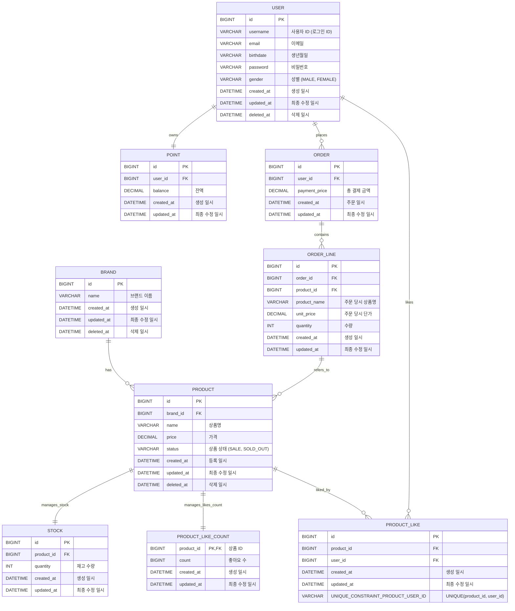

```mermaid
erDiagram
    BRAND {
        BIGINT id PK
        VARCHAR name "브랜드 이름"
        DATETIME created_at "생성 일시"
        DATETIME updated_at "최종 수정 일시"
        DATETIME deleted_at "삭제 일시"
    }

    PRODUCT {
        BIGINT id PK
        BIGINT brand_id FK
        VARCHAR name "상품명"
        DECIMAL price "가격"
        VARCHAR status "상품 상태 (SALE, SOLD_OUT)"
        DATETIME created_at "등록 일시"
        DATETIME updated_at "최종 수정 일시"
        DATETIME deleted_at "삭제 일시"
    }

    PRODUCT_LIKE_COUNT {
        BIGINT product_id PK,FK "상품 ID"
        BIGINT count "좋아요 수"
        DATETIME created_at "생성 일시"
        DATETIME updated_at "최종 수정 일시"
    }

    PRODUCT_LIKE {
        BIGINT id PK
        BIGINT product_id FK
        BIGINT user_id FK
        DATETIME created_at "생성 일시"
        DATETIME updated_at "최종 수정 일시"
        VARCHAR UNIQUE_CONSTRAINT_PRODUCT_USER_ID "UNIQUE(product_id, user_id)"
    }

    USER {
        BIGINT id PK
        VARCHAR username "사용자 ID (로그인 ID)"
        VARCHAR email "이메일"
        VARCHAR birthdate "생년월일"
        VARCHAR password "비밀번호"
        VARCHAR gender "성별 (MALE, FEMALE)"
        DATETIME created_at "생성 일시"
        DATETIME updated_at "최종 수정 일시"
        DATETIME deleted_at "삭제 일시"
    }

    ORDER {
        BIGINT id PK
        BIGINT user_id FK
        DECIMAL payment_price "총 결제 금액"
        DATETIME created_at "주문 일시"
        DATETIME updated_at "최종 수정 일시"
    }

    ORDER_LINE {
        BIGINT id PK
        BIGINT order_id FK
        BIGINT product_id FK
        VARCHAR product_name "주문 당시 상품명"
        DECIMAL unit_price "주문 당시 단가"
        INT quantity "수량"
        DATETIME created_at "생성 일시"
        DATETIME updated_at "최종 수정 일시"
    }

    POINT {
        BIGINT id PK
        BIGINT user_id FK
        DECIMAL balance "잔액"
        DATETIME created_at "생성 일시"
        DATETIME updated_at "최종 수정 일시"
    }

    STOCK {
        BIGINT id PK
        BIGINT product_id FK
        INT quantity "재고 수량"
        DATETIME created_at "생성 일시"
        DATETIME updated_at "최종 수정 일시"
    }

    BRAND ||--o{ PRODUCT : has
    PRODUCT ||--o{ PRODUCT_LIKE : liked_by
    PRODUCT ||--|| PRODUCT_LIKE_COUNT : manages_likes_count
    USER ||--o{ PRODUCT_LIKE : likes
    USER ||--o{ ORDER : places
    "ORDER" ||--o{ ORDER_LINE : contains
    ORDER_LINE ||--o{ PRODUCT : refers_to
    USER ||--|| POINT : owns
    PRODUCT ||--|| STOCK : manages_stock
```