# 🏷 브랜드 & 상품 (Brands / Products)

## 📌 상품 목록 조회

```mermaid
sequenceDiagram
    actor U as User
    participant PC as ProductController
    participant PS as ProductService
    participant PR as ProductRepository

    U ->> PC: 상품 목록 조회 요청 (필터, 정렬, 페이징)
    activate PC
    
    PC ->> PS: 상품 목록 조회 (필터, 정렬, 페이징)
    activate PS
    
    PS ->> PR: 판매 중인 상품 조회 (필터, 정렬, 페이징)
    activate PR
    
    PR -->> PS: 상품 목록 및 페이징 정보 응답
    deactivate PR
    
    PS -->> PC: 상품 목록 및 페이징 정보 응답
    deactivate PS
    
    PC -->> U: 200 OK
    deactivate PC
```

## 📌 상품 상세 정보 조회

```mermaid
sequenceDiagram
    actor U as User
    participant PC as ProductController
    participant PS as ProductService
    participant PR as ProductRepository
    
    U ->> PC: 상품 상세 정보 조회 요청
    activate PC
    
    PC ->> PS: 상품 상세 정보 조회
    activate PS
    
    PS ->> PR: 상품 상세 정보 조회
    activate PR
    
    PR -->> PS: 상품 상세 정보 응답
    deactivate PR
    
    opt 상품 미존재 시
        PS --x U: 404 NOT FOUND
    end
	
	PS -->> PC: 상품 상세 정보 응답
    deactivate PS
    PC -->> U: 200 OK
    deactivate PC
```

## 📌 브랜드 정보 조회

```mermaid
sequenceDiagram
    actor U as User
    participant BC as BrandController
    participant BS as BrandService
    participant BR as BrandRepository
    
    U ->> BC: 브랜드 정보 조회 요청
    activate BC
    
    BC ->> BS: 브랜드 정보 조회
    activate BS
    
    BS ->> BR: 브랜드 정보 조회
    activate BR
    
    BR -->> BS: 브랜드 정보 응답
    deactivate BR
    
    opt 브랜드 미존재 시
        BS -->> U: 404 NOT FOUND
    end 
    
    BS -->> BC: 브랜드 정보 응답
    deactivate BS
    BC -->> U: 200 OK
    deactivate BC
```

---

# ❤️ 좋아요 (Likes)

## 📌 상품 좋아요 등록

```mermaid
sequenceDiagram
    actor U as User
    participant PC as ProductController
    participant PS as ProductService
    participant US as UserService
    participant PR as ProductRepository
	
    U ->> PC: 상품 좋아요 등록 요청 (상품 ID)
    activate PC
    PC ->> PC: 사용자 인증 확인 (X-USER-ID)
    
    opt 인증 실패 시
	    PC -->> U: 401 UNAUTHORIZED
	end
	
	PC ->> PS: 상품 좋아요 등록 (상품 ID, 사용자 ID)
	activate PS
	
	PS ->> US: 사용자 조회
	activate US
	US -->> PS: 사용자 정보 응답
	deactivate US
	
	opt 사용자 미존재 시
		PS -->> U: 404 NOT FOUND
	end
	
	PS ->> PR: 상품 조회
	activate PR
	PR -->> PS: 상품 정보 응답
	deactivate PR
	
	opt 상품 미존재 시
		PS -->> U: 404 NOT FOUND
	end
	
	PS ->> PR: 상품 좋아요 등록 (상품 ID, 사용자 ID)
	activate PR
	
	opt 이미 등록된 경우
		PR -->> PS: 유니크 제약 조건 위반 예외 발생
		PS ->> PS: 성공으로 간주
		PS -->> U: 201 CREATED
	end
	
	PR -->> U: 201 CREATED
	deactivate PR
	deactivate PS
	deactivate PC
```

## 📌 상품 좋아요 취소

```mermaid
sequenceDiagram
    actor U as User
    participant PC as ProductController
    participant PS as ProductService
    participant PR as ProductRepository
	
	U ->> PC: 상품 좋아요 취소 요청 (상품 ID)
	activate PC
    PC ->> PC: 사용자 인증 확인 (X-USER-ID)
    
    opt 인증 실패 시
	    PC -->> U: 401 UNAUTHORIZED
	end
	
	PC ->> PS: 상품 좋아요 취소 (상품 ID, 사용자 ID)
	activate PS
	PS ->> PR: 상품 좋아요 삭제 (상품 ID, 사용자 ID)
	activate PR
	PR -->> U: 204 NO CONTENT
	deactivate PR
	deactivate PS
	deactivate PC
```

---

# 🧾 주문 / 결제 (Orders)

## 📌 주문 요청

```mermaid
sequenceDiagram
	actor U as USER
	participant OC as OrderController
	participant OS as OrderService
	participant US as UserService
	participant PS as ProductService
	participant SS as StockService
	participant POS as PointService
	participant OR as OrderRepository
	
	U ->> OC: 주문 요청
	activate OC
	OC ->> OC: 사용자 인증 확인 (X-USER-ID)
	
	opt 인증 실패 시
		OC -->> U: 401 UNAUTHORIZED
	end
	
	OC ->> OS: 주문 생성
	activate OS
	OS ->> US: 사용자 조회
	activate US
	US -->> OS: 사용자 정보 응답
	deactivate US
	
	alt 사용자 미존재 시
		OS -->> U: 404 NOT FOUND
	end
	
	OS ->> SS: 재고 차감 요청 (상품 ID, 주문 수량)
	activate SS
	
	opt 재고 부족 시
		SS -->> U: 409 CONFLICT
	end
	
	SS -->> OS: 재고 차감 성공
	deactivate SS
	OS ->> POS: 포인트 사용 요청 (사용자 ID, 결제 금액)
	activate POS
	
	opt 포인트 부족 시
		POS -->> U: 409 CONFLICT
	end
	
	POS -->> OS: 포인트 사용 성공
	deactivate POS
	OS ->> OR: 주문 내역 생성
	activate OR
	OR -->> U: 201 CREATED
	deactivate OR
	deactivate OS
	deactivate OC
```

## 📌 주문 목록 조회

```mermaid
sequenceDiagram
    actor U as USER
	participant OC as OrderController
	participant OS as OrderService
	participant US as UserService
	participant OR as OrderRepository
	
	U ->> OC: 주문 목록 조회 요청
	OC ->> OC: 사용자 인증 확인 (X-USER-ID)
	
	opt 인증 실패 시
		OC -->> U: 401 UNAUTHORIZED
	end
	
	OC ->> OS: 주문 목록 조회
	OS ->> US: 사용자 조회
	US -->> OS: 사용자 정보 응답
	
	opt 사용자 미존재 시
		OS -->> U: 404 NOT FOUND
	end
	
	OS ->> OR: 주문 목록 조회
	OR -->> OC: 주문 목록 응답
    OC -->> U: 200 OK
```

## 📌 주문 상세 조회

```mermaid
sequenceDiagram
    actor U as USER
	participant OC as OrderController
	participant OS as OrderService
	participant US as UserService
	participant OR as OrderRepository
	
	U ->> OC: 주문 상세 조회 요청 (주문 ID)
	activate OC
	OC ->> OC: 사용자 인증 확인 (X-USER-ID)
	
	opt 인증 실패 시
		OC -->> U: 401 UNAUTHORIZED
	end
	
	OC ->> OS: 주문 상세 조회 (주문 ID, 사용자 ID)
	activate OS
	OS ->> US: 사용자 조회
	activate US
	US -->> OS: 사용자 정보 응답
	deactivate US
	
	opt 사용자 미존재 시
		OS -->> U: 404 NOT FOUND
	end
	
	OS ->> OR: 주문 상세 조회
	activate OR
	OR -->> OS: 주문 상세 정보 응답
	deactivate OR
	
	opt 주문 미존재 시
		OS -->> U: 404 NOT FOUND
	end
	
    OS -->> U: 200 OK
    deactivate OS
    deactivate OC
```

