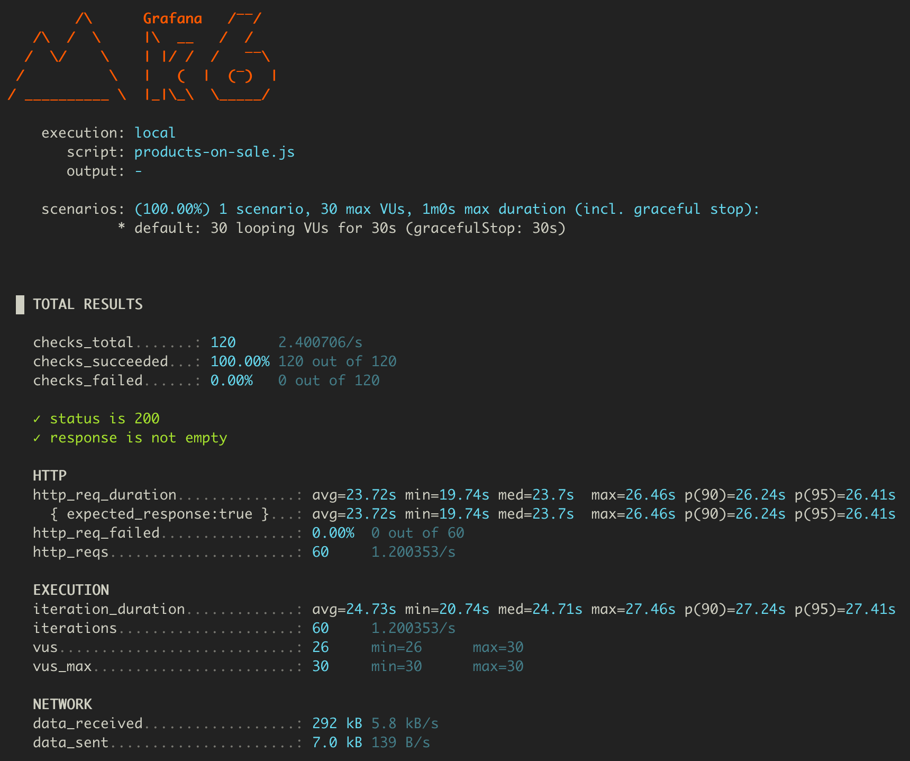
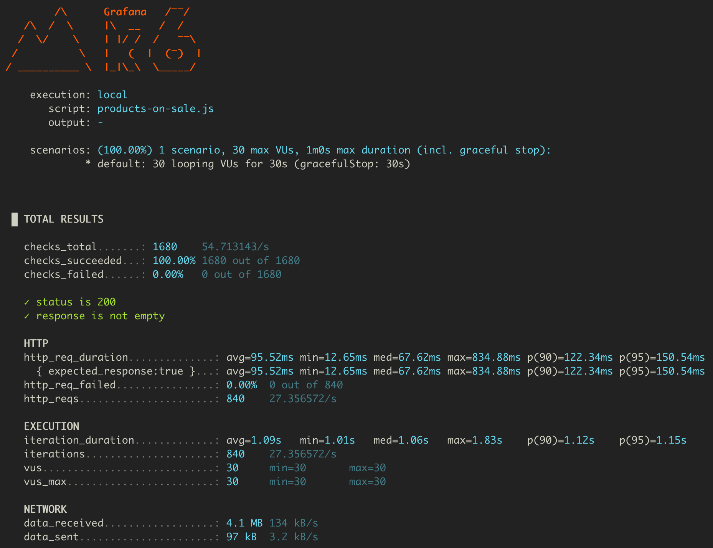
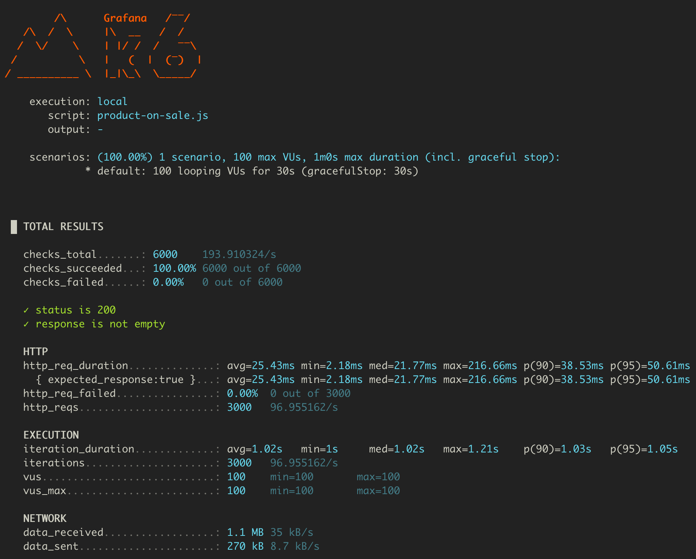
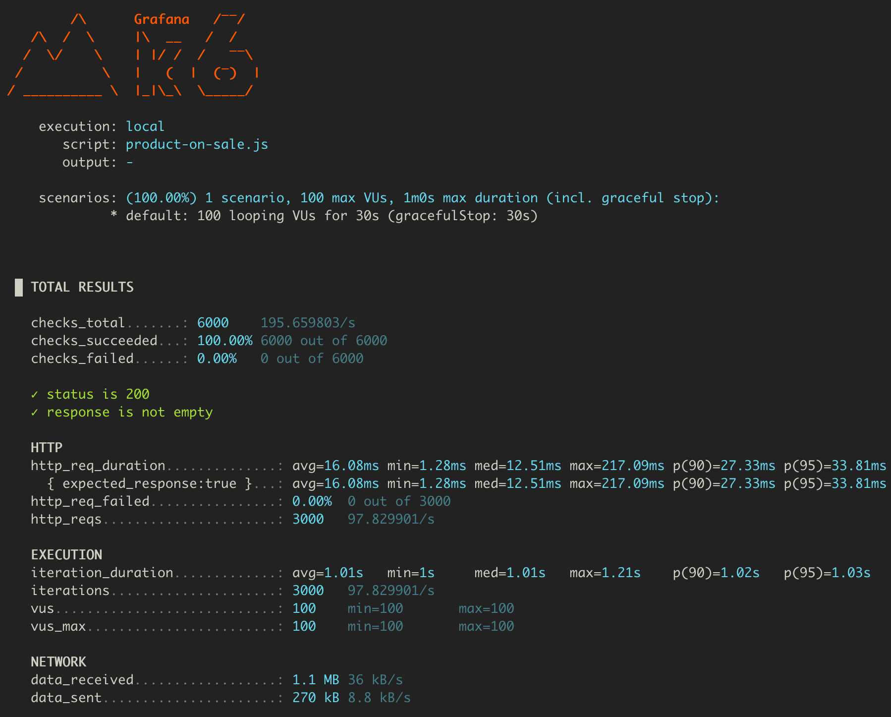

# 좋아요 카운트 비정규화

```sql
SELECT p.id, p.name, p.price, p.brand_id, COUNT(l.id) AS like_count  
FROM product p  
LEFT JOIN likes l  
ON l.target_id = p.id AND l.target_type = 'PRODUCT'  
GROUP BY p.id  
ORDER BY like_count DESC, p.id DESC  
LIMIT 20 OFFSET 0;
```

## 비정규화 전



## 비정규화 후



|지표|비정규화 전|비정규화 후|변화 및 분석|
|---|---|---|---|
|HTTP 요청 평균 응답 시간|23.72초|95.52밀리초|약 248배 개선 (대폭 단축)|
|HTTP 요청 최대 응답 시간|26.46초|834.88밀리초|획기적 감소|
|HTTP 요청 실패율|0.00% (0/60)|0.00% (0/840)|안정성 동일|
|초당 처리량 (http_reqs/s)|1.2 req/s|27.36 req/s|약 22.8배 증가|
|평균 iteration_duration|24.73초|1.09초|약 22.7배 빨라짐|
|최대 iteration_duration|27.46초|1.83초|매우 큰 감소|

- **비정규화 적용 후**, 그룹 집계 쿼리를 대체해 읽기 성능이 획기적으로 개선되었습니다.

- 요청 응답시간, 처리량, 실행시간 등 전 영역에서 압도적 성능 향상이 있었으며, 고부하 상황이나 대용량 데이터 환경에서도 훨씬 여유롭고 안정적으로 동작하는 것을 기대해 볼 수 있습니다.

---

# 상품 상세 정보 조회

## 캐시 미적용



## 캐시 적용



## 1. HTTP 요청 시간 (`http_req_duration`)

| 구분        | 평균(avg)  | 중앙값(med) | p90      | p95      | 최소(min) | 최대(max)   |
| --------- | -------- | -------- | -------- | -------- | ------- | --------- |
| **미적용**   | 25.43 ms | 21.77 ms | 38.53 ms | 50.61 ms | 2.18 ms | 216.66 ms |
| **캐시 적용** | 16.08 ms | 12.51 ms | 27.33 ms | 33.81 ms | 1.28 ms | 217.09 ms |

**📌 결과:**

- 평균 응답시간: **-36.8% 단축** (25.43 → 16.08 ms)

- 중앙값, p90, p95 모두 줄어서 **일관성 있는 속도 향상**을 보였습니다.

- 최대 응답시간은 비슷했습니다. (캐시 미적용 216.66ms vs 캐시 적용 217.09ms)

---

# 판매중인 상품 목록 조회

## 캐시 미적용


## 캐시 적용


## 1. HTTP 요청 시간 (`http_req_duration`)

| 구분         | 평균(avg)  | 중앙값(med) | p90       | p95       | 최소(min) | 최대(max)   |
| ---------- | -------- | -------- | --------- | --------- | ------- | --------- |
| **캐시 미적용** | 89.76 ms | 55.81 ms | 164.31 ms | 257.07 ms | 9.49 ms | 646.75 ms |
| **캐시 적용**  | 34.85 ms | 16.28 ms | 75.5 ms   | 107.25 ms | 1.33 ms | 283.71 ms |

📌 **결과:**

- 캐시 적용 시 **평균 응답시간이 약 61% 단축**되었습니다. (89.76 → 34.85 ms)

- p90, p95 모두 절반 이하로 개선되었습니다. → **일관된 성능 향상**

---

# 📌 종합 분석

- **비정규화**와 **캐시 적용** 모두에서, 서비스 응답속도와 처리량은 각각 수십~수백 배 단위까지 획기적으로 향상되었으며, 실제 요청 성능, 대량 처리 상황, 안정성이 모두 개선되었습니다.

- **비정규화**는 테이블 조인/그룹 쿼리로 인한 속도 병목을 원천 차단하였습니다.

- **캐시 적용**은 반복 호출이나 집중 트래픽에서의 속도 저하와 부하를 해소합니다.

- 그 결과, 시스템의 확장성, 사용자 경험, 서버 운영 효율성 모두 현격히 성장했습니다.